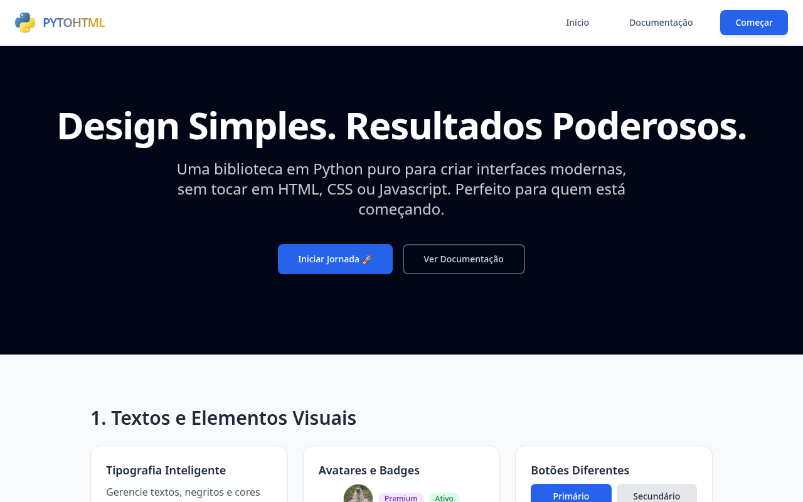
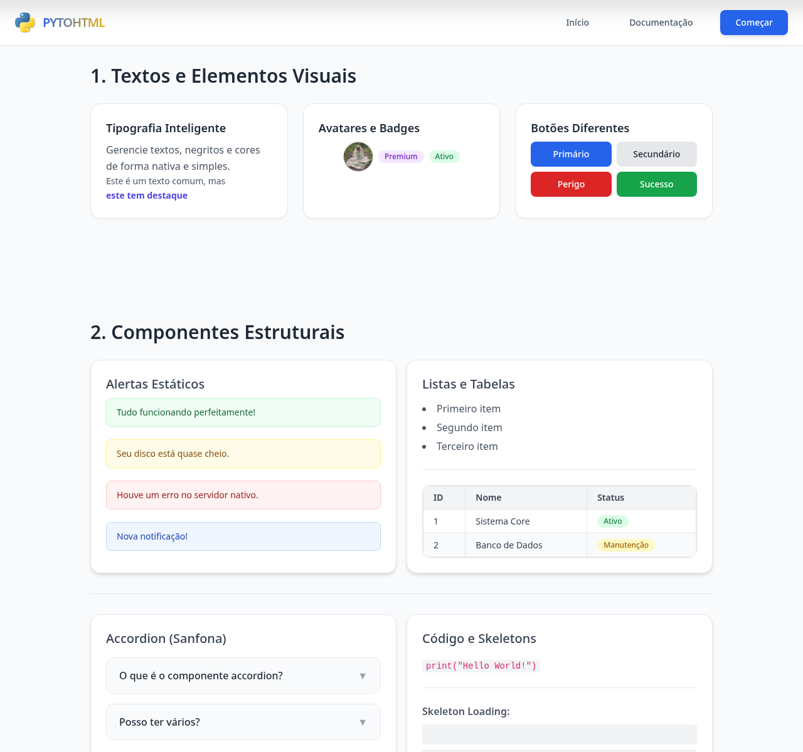
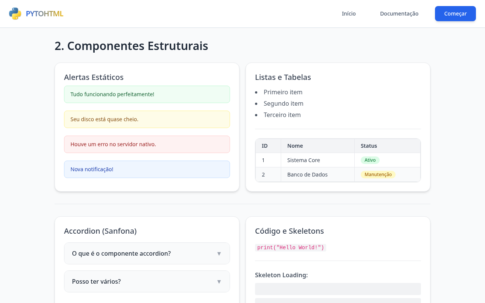
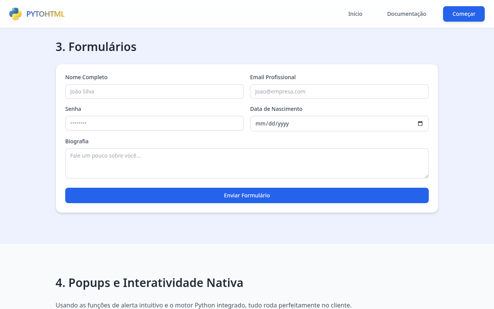
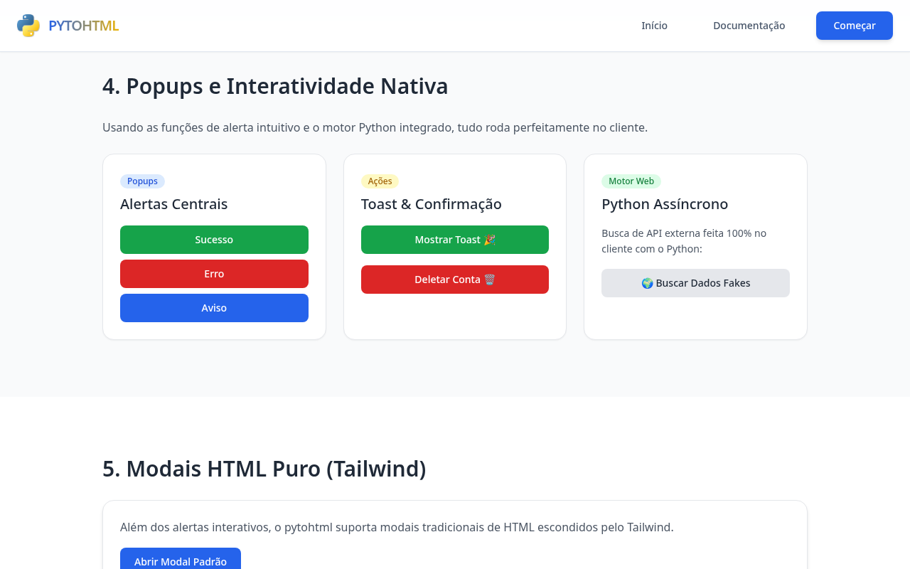

# pytohtml

> Biblioteca Python pura para criar páginas HTML modernas com Tailwind CSS — sem escrever HTML, CSS ou JavaScript.



---

## O que é

**pytohtml** é uma biblioteca Python que permite construir interfaces web completas usando apenas código Python. Cada elemento da página — títulos, botões, formulários, tabelas, modais, grids — é uma função Python que retorna HTML semântico estilizado com Tailwind CSS.

O fluxo é simples: você escreve Python, a biblioteca gera um arquivo `.html` pronto para abrir no navegador, compartilhar ou hospedar em qualquer servidor estático.

**Por que usar?**

- **Zero dependências Python** — nada para instalar via pip. Tailwind CSS, SweetAlert2 e Brython carregam via CDN.
- **Sem templates** — você não escreve strings de HTML. A estrutura é definida pela composição de funções.
- **Interatividade opcional** — alertas e confirmações funcionam via SweetAlert2 sem JavaScript manual. Para lógica mais complexa, Brython permite executar Python diretamente no browser.
- **Componentes prontos** — grids responsivos, skeleton loading, accordion, modais nativos e tabelas estilizadas já estão incluídos.
- **Ideal para quem está aprendendo** — uma forma de criar resultados visuais reais sem sair do ecossistema Python.

---

## Instalação

Copie a pasta `pytohtml/` para dentro do seu projeto:

```
meu-projeto/
├── pytohtml/
│   ├── __init__.py
│   ├── pagina.py
│   ├── elementos.py
│   ├── layout.py
│   └── interatividade.py
└── meu_script.py
```

Ou clone o repositório e execute seus scripts a partir da raiz:

```bash
git clone https://github.com/GabrielUzeda/pytohtml.git
cd pytohtml
python meu_script.py
```

**Requisitos:** Python 3.10+ · Conexão com internet (Tailwind e SweetAlert2 via CDN)

---

## Início rápido

```python
from pytohtml import *

pagina = html(
    cabecalho(nav(
        titulo("Meu Site", tamanho="medio"),
        botao("Contato", variante="primario"),
        classes="w-full justify-between"
    )),
    secao(container(
        titulo("Bem-vindo ao pytohtml", tamanho="gigante"),
        paragrafo("HTML gerado com Python puro, estilizado com Tailwind CSS."),
        linha(
            botao("Começar agora", variante="primario"),
            botao("Ver docs", variante="secundario"),
        )
    )),
    titulo_pagina="Meu Site"
)

salvar("index.html", pagina)
```

```bash
python meu_script.py
# Abra index.html no navegador
```

---

## O que você pode construir

### Elementos e tipografia



Títulos semânticos (`<h1>`–`<h4>`), parágrafos, links, listas, botões com variantes de cor (primário, secundário, perigo, sucesso), avatares com foto ou iniciais, badges coloridas, imagens responsivas e blocos de código — tudo com uma chamada de função.

---

### Componentes estruturais



Alertas estáticos com quatro níveis de severidade, tabelas geradas a partir de listas Python, cards de conteúdo, accordion nativo sem JavaScript, código com destaque de sintaxe e skeleton loading para estados de carregamento.

---

### Formulários



Labels semânticos, inputs estilizados, campos de senha e data, textarea com redimensionamento vertical e o wrapper `formulario()` que organiza tudo com espaçamento automático entre campos.

---

### Interatividade



Popups elegantes via SweetAlert2 sem JavaScript manual: alertas de sucesso/erro/aviso, toasts não intrusivos e diálogos de confirmação. Para lógica mais avançada, Brython permite escrever handlers de eventos, estado reativo e chamadas a APIs externas — tudo em Python.

---

## Módulos

| Módulo | Funções |
|--------|---------|
| `pagina.py` | `html()`, `salvar()` |
| `elementos.py` | `titulo`, `paragrafo`, `botao`, `etiqueta`, `link`, `divisor`, `aviso_estatico`, `cartao`, `lista`, `tabela`, `imagem`, `avatar`, `codigo`, `animacao_carregando`, `accordion`, `rotulo`, `entrada`, `textarea`, `formulario` |
| `layout.py` | `linha`, `coluna`, `grade`, `container`, `secao`, `cabecalho`, `rodape`, `nav`, `modal`, `destaque` |
| `interatividade.py` | `ao_clicar`, `ao_carregar`, `script_python`, `espaco_dinamico`, `inserir_html`, `estado`, `buscar_dados`, `enviar_formulario`, `alerta`, `alerta_sucesso`, `alerta_erro`, `alerta_aviso`, `alerta_info`, `notificacao_rapida`, `alerta_ao_clicar`, `pedir_confirmacao`, `alerta_ao_enviar`, `abrir_modal_ao_clicar` |

---

## Exemplo com Brython

Ative `brython=True` para usar Python como linguagem de interatividade no browser:

```python
from pytohtml import *

pagina = html(
    espaco_dinamico("contador", "text-center text-4xl font-bold mt-8"),
    botao("Incrementar", variante="primario", classes='id="btn-inc"'),
    estado("contador", "0", "#contador"),
    ao_clicar("#btn-inc", '''
        contador_atual = int(_estado["contador"])
        set_estado("contador", contador_atual + 1)
    '''),
    titulo_pagina="Contador",
    brython=True,
)

salvar("contador.html", pagina)
```

---

## Documentação

A documentação completa com exemplos de cada função está disponível na **[Wiki do projeto](https://github.com/GabrielUzeda/pytohtml/wiki)**.

| Seção | O que cobre |
|-------|-------------|
| [Instalação](https://github.com/GabrielUzeda/pytohtml/wiki/Instalacao) | Requisitos, setup e primeiro uso |
| [Elementos Básicos](https://github.com/GabrielUzeda/pytohtml/wiki/titulo) | titulo, paragrafo, link, lista, imagem, codigo |
| [Componentes Visuais](https://github.com/GabrielUzeda/pytohtml/wiki/botao) | botao, etiqueta, avatar, aviso, skeleton |
| [Formulários](https://github.com/GabrielUzeda/pytohtml/wiki/formulario) | rotulo, entrada, textarea, formulario |
| [Layout](https://github.com/GabrielUzeda/pytohtml/wiki/container) | container, grade, linha, coluna, nav, cabecalho |
| [Elementos Avançados](https://github.com/GabrielUzeda/pytohtml/wiki/cartao) | cartao, accordion, tabela, modal |
| [SweetAlert2](https://github.com/GabrielUzeda/pytohtml/wiki/alerta) | alerta, toast, confirmação, modal ao clicar |
| [Brython](https://github.com/GabrielUzeda/pytohtml/wiki/ao-clicar) | ao_clicar, estado, buscar_dados, enviar_formulario |

---

## Licença

[GPL-3.0](LICENSE)
